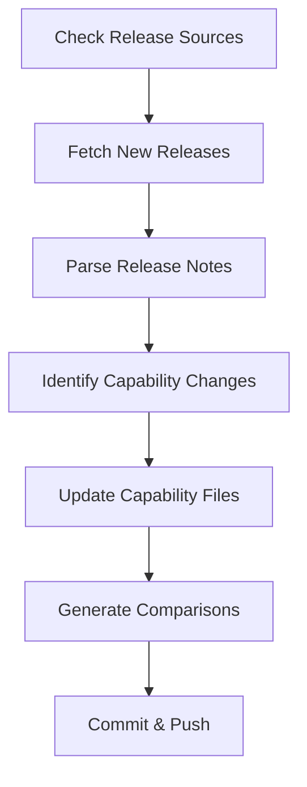

# AI Agent Capabilities Framework

Automated tracking and comparison of AI coding agent capabilities.

## Overview

This repository provides a structured framework for tracking and comparing the capabilities of different AI coding agents:

- **Visual Studio Code Copilot** (GitHub/Microsoft)
- **GitHub Copilot CLI** (GitHub)
- **Claude for Coding** (Anthropic)
- **Google Gemini for Coding** (Google)

## Repository Structure

```
├── agents/                          # Individual agent data
│   ├── vscode-copilot/
│   │   ├── capabilities/            # Current capabilities
│   │   │   └── current.json
│   │   ├── documentation/           # Cached documentation
│   │   └── releases/                # Release notes history
│   ├── copilot-cli/
│   ├── claude-code/
│   └── gemini-cli/
├── comparisons/                     # Generated comparison reports
│   ├── README.md                    # Human-readable comparison
│   ├── comparison-matrix.json       # Structured comparison data
│   └── capability-summary.json      # Summary statistics
├── framework/                       # Framework tools
│   ├── schemas/                     # JSON schemas
│   │   ├── capability-schema.json
│   │   └── release-note-schema.json
│   ├── scripts/                     # Automation scripts
│   │   ├── generate_comparison.py
│   │   ├── fetch_releases.py
│   │   └── update_automation.sh
│   └── templates/                   # Templates for new agents
└── SOURCES.md                       # Documentation source registry
```

## Quick Start

### 1. Generate Capability Comparisons

```bash
python3 framework/scripts/generate_comparison.py
```

This generates:
- `comparisons/README.md` - Human-readable comparison table
- `comparisons/comparison-matrix.json` - Structured comparison data
- `comparisons/capability-summary.json` - Summary statistics

### 2. Fetch Latest Release Notes

```bash
python3 framework/scripts/fetch_releases.py
```

Fetches release notes from the past 2 months for all tracked agents.

### 3. Run Full Update

```bash
bash framework/scripts/update_automation.sh
```

This runs the complete update cycle:
1. Fetches latest release notes
2. Updates capability files (manual review required)
3. Regenerates comparisons

## Capability Categories

Agents are compared across these categories:

- **code-completion** - Inline suggestions and completions
- **code-generation** - Generate code from descriptions
- **chat-assistance** - Interactive coding help
- **code-explanation** - Explain existing code
- **code-refactoring** - Improve code structure
- **testing** - Generate and run tests
- **debugging** - Find and fix bugs
- **documentation** - Generate docs and comments
- **command-line** - Terminal/CLI assistance
- **multi-file-editing** - Work across multiple files
- **context-awareness** - Understanding project context
- **language-support** - Programming language coverage
- **ide-integration** - IDE and editor support
- **api-integration** - API access and integration
- **customization** - Personalization options
- **security** - Security features
- **performance** - Speed and efficiency
- **collaboration** - Team features
- **model-selection** - Choice of AI models
- **agent-orchestration** - Multi-agent workflows

## Data Schemas

### Capability Schema

Each agent's capabilities are documented in `agents/*/capabilities/current.json` following the schema in `framework/schemas/capability-schema.json`.

Key fields:
- `agent` - Agent metadata (name, vendor, version)
- `capabilities` - Array of capability objects
- `integrations` - Platform integrations
- `models` - Available AI models
- `documentation` - Links to official docs

### Release Note Schema

Release notes are stored in `agents/*/releases/*.json` following the schema in `framework/schemas/release-note-schema.json`.

Key fields:
- `version` - Release version
- `releaseDate` - Release date
- `changes` - Array of changes (features, fixes, etc.)
- `capabilitiesAdded/Modified/Removed` - Capability changes

## Automation

### Automated Updates

The framework is designed for periodic automated updates:

1. **Daily**: Fetch new release notes
2. **Weekly**: Review and update capability files
3. **On-demand**: Generate fresh comparisons

### GitHub Actions (Future)

A GitHub Actions workflow can be set up to:
- Run daily release note fetches
- Create PRs for new releases
- Auto-generate comparison updates
- Notify on significant capability changes

### Update Workflow



## Documentation Sources

All official documentation sources are tracked in [SOURCES.md](SOURCES.md).

Each agent has:
- Official documentation URLs
- Release notes/changelog URLs
- GitHub repository links
- API documentation

## Adding a New Agent

1. Create agent directory structure:
   ```bash
   mkdir -p agents/new-agent/{capabilities,documentation,releases}
   ```

2. Create `current.json` using the capability schema

3. Add agent configuration to `framework/scripts/fetch_releases.py`

4. Add documentation sources to `SOURCES.md`

5. Run comparison generator to include the new agent

## Manual Review Process

While automation fetches release notes, manual review is required to:

1. Interpret release notes for capability changes
2. Update capability files with new features
3. Categorize capabilities correctly
4. Verify accuracy of comparisons

## Contributing

When updating agent capabilities:

1. Use the provided JSON schemas
2. Maintain consistent capability naming
3. Add source URLs for verification
4. Update the comparison after changes
5. Document significant capability additions

## Maintenance

### Update Capability Files

```bash
# Edit capability file
vim agents/vscode-copilot/capabilities/current.json

# Regenerate comparisons
python3 framework/scripts/generate_comparison.py
```

### Check for New Releases

```bash
# Fetch releases from past 2 months
python3 framework/scripts/fetch_releases.py

# Review new releases
ls agents/*/releases/
```

## License

This repository is for tracking publicly available information about AI coding agents.

## Credits

Maintained by the AI Agent Capabilities project.

Data sourced from official documentation and release notes of:
- GitHub Copilot (GitHub/Microsoft)
- Claude (Anthropic)
- Gemini (Google)
