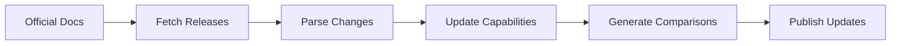

# AI Agent Capabilities Tracker

An always up-to-date, systematically maintained index of AI coding agent capabilities and configurations. This repository tracks, compares, and monitors the capabilities of major AI coding assistants including GitHub Copilot, Claude, and Google Gemini.

## 🎯 Purpose

This project provides:

- **Comprehensive Capability Tracking**: Structured documentation of features across all major AI coding agents
- **Automated Comparison**: Side-by-side capability comparisons updated automatically
- **Release Monitoring**: Continuous tracking of new features and updates from official sources
- **Repeatable Framework**: Automated scripts for maintaining up-to-date information

## 🚀 Quick Start

### View Capability Comparisons

The latest capability comparison is available in [comparisons/README.md](comparisons/README.md).

### Generate Fresh Comparisons

```bash
python3 framework/scripts/generate_comparison.py
```

### Fetch Latest Release Notes

```bash
python3 framework/scripts/fetch_releases.py
```

### Run Full Update Cycle

```bash
bash framework/scripts/update_automation.sh
```

## 📊 Tracked Agents

| Agent | Vendor | Status |
|-------|--------|--------|
| **GitHub Copilot for VS Code** | GitHub / Microsoft | ✅ Active |
| **GitHub Copilot CLI** | GitHub | ✅ Active |
| **Claude for Coding** | Anthropic | ✅ Active |
| **Google Gemini for Coding** | Google | ✅ Active |

## 📁 Repository Structure

```
.
├── agents/                      # Agent-specific data
│   ├── vscode-copilot/         # VS Code Copilot
│   ├── copilot-cli/            # GitHub CLI Copilot
│   ├── claude-code/            # Claude coding capabilities
│   └── gemini-cli/             # Google Gemini
├── comparisons/                # Generated comparisons
│   ├── README.md               # Human-readable comparison
│   ├── comparison-matrix.json  # Structured data
│   └── capability-summary.json # Summary statistics
├── framework/                  # Automation framework
│   ├── scripts/                # Automation scripts
│   └── schemas/                # Data schemas
├── FRAMEWORK.md                # Detailed framework docs
└── SOURCES.md                  # Documentation sources

```

## 🔄 Automation

This framework is designed to be **automatic and repeatable**:

### Daily Automation
- **GitHub Actions** runs daily to fetch new release notes
- Creates PRs when new releases are detected
- Auto-generates comparisons when capability files are updated

### Manual Updates
When new releases are found:
1. Review release notes in `agents/*/releases/`
2. Update capability files in `agents/*/capabilities/current.json`
3. Run comparison generator
4. Commit and push changes

## 📖 Documentation

- **[FRAMEWORK.md](FRAMEWORK.md)** - Complete framework documentation
- **[SOURCES.md](SOURCES.md)** - Official documentation sources for each agent
- **[comparisons/README.md](comparisons/README.md)** - Latest capability comparison

## 🏗️ Capability Categories

Agents are compared across 20+ categories:

- Code completion & generation
- Chat assistance & code explanation
- Testing & debugging
- Documentation generation
- Command-line integration
- Multi-file editing & refactoring
- Context awareness & workspace understanding
- IDE & platform integrations
- Model selection & customization
- Security features
- And more...

## 🔍 How It Works



1. **Monitoring**: Scripts fetch release notes from official sources
2. **Analysis**: Release notes are parsed for capability changes
3. **Documentation**: Capability files are updated with new features
4. **Comparison**: Automated scripts generate comparison matrices
5. **Publishing**: Changes are committed and comparisons are updated

## 🛠️ Development

### Prerequisites

- Python 3.8+
- Git

### Adding a New Agent

1. Create directory structure:
   ```bash
   mkdir -p agents/new-agent/{capabilities,documentation,releases}
   ```

2. Create capability file following the schema in `framework/schemas/capability-schema.json`

3. Add configuration to `framework/scripts/fetch_releases.py`

4. Run comparison generator to include the new agent

## 📅 Update Schedule

- **Daily**: Automated release note fetching via GitHub Actions
- **Weekly**: Manual review of new releases and capability updates
- **Monthly**: Full audit of all documentation sources
- **Quarterly**: Framework and script updates

## 📄 License

This repository tracks publicly available information about AI coding agents. All data is sourced from official documentation and release notes.

## 🤝 Contributing

Contributions are welcome! Please:

1. Follow the established schemas
2. Add source URLs for verification
3. Update comparisons after capability changes
4. Document significant additions

## 📚 Resources

- [GitHub Copilot Documentation](https://docs.github.com/en/copilot)
- [Anthropic Claude Documentation](https://docs.anthropic.com/)
- [Google Gemini Documentation](https://ai.google.dev/gemini-api/docs)

---

**Last Updated**: 2026-02-17  
**Framework Version**: 1.0.0
